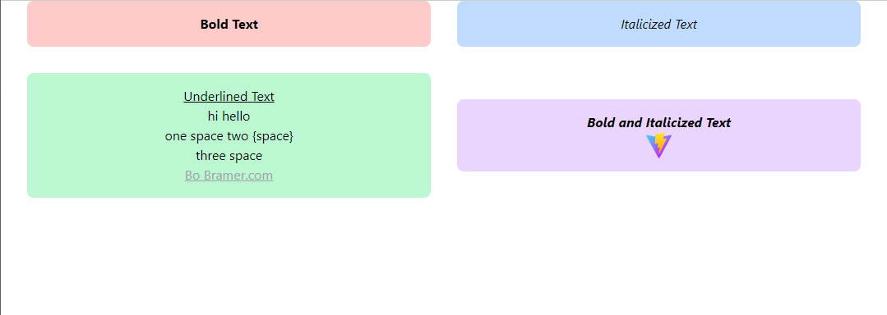

# Page Parser

This is a package that allows you to use TeX syntax to quickly create React webpages. You can build a custom component library, then build your pages using TeX syntax. This library will then compile your TeX code into React components to be displayed on your website.

## Version 1.0.1

Currently, div, p, and br default classes are implemented. Tree works with componentDefinition and DefaultComponent.

## Installation

NPM:

```.
npm i @wuguishifu/page-parser
```

## Usage with Tailwind CSS

This package lets you define class names in the tex files. If you want to use Tailwind CSS, add "tex" to your tailwind.config.js as follows:

```js
export default {
    content: [
        ...,
        "./index.html",
-       "./src/**/*.{js,ts,jsx,tsx}"
+       "./src/**/*.{js,ts,jsx,tsx,tex}"
    ],
    ...
};
```

## Documentation

### Plain Text

Formatted text can be rendered in a few different ways such as:

- \*\*Bold Text\*\* **Bold Text**
- \*Italicized Text\* *Italicized Text*
- \_\_Underlined Text\_\_ **Underlined Text**
- \*\*\*Bold and Italicized Text\*\*\* ***Bold and Italicized Text***

Some important things to note:

Plain text separated by a single line will be condensed into one line, while plain text separated by multiple lines will remain separated. This is an intentional design choice that helps with .tex formatting while editing

### Default Components

#### Image

```tex
\image{src}[className]
```

#### Hyperlink

```tex
\url{link}{display}[className]
```

#### Horizontal and Vertical spacing

```tex
\vspace{space values (accepts number, string)}
```

```tex
\hspace{space values (accepts number, string)}
```

### Custom Components

You can define a custom JSX component to use in your tex definition. Every component definition can have `values`, `className`, and `children` values. Here are the type definitions for these props:

```ts
type ComponentProps = {
    className?: string;
    children?: React.ReactNode;
    values?: string[]
};
```

A empty component will not have children. This is an example of that:

```tex
\componentName{value1}{value2}{value3}{...}[className]
```

A environment component will have children. This is an example of that:

```tex
\begin{componentName}{value1}{value2}{value3}{...}[className]
    children go here
    these can be plain text, empty components, or nested environment components
\end{componentName}
```

### Compilation

You can use the `npx page-parser:compile` script to generate React components from the latex code. The usage is `npx page-parser:compile <inputPath> <outputPath> [flags]`. You will get a warning if you use an output path that already exists, which you can supress using the `-f` or `--force` flag. This will generate a file in the following format:

```tsx
import Component1 from '@/components/Component1';
import Component2 from '@/components/Component2';

export default function Page() {
    return (
        <Component1>
            <Component2>
                hello world
            </Component2>
        </Component1>
    );
};
```

Please feel free to modify the generated code as required. This by default uses the @/components/* import. The custom components should be exported as default functions, and the component name is expected to be the same as the file name. In the future, I want to make a more modular way to do this with potentially a config file.

### Debugging

A debug component is also included. You can use this to view the parse tree of the tex string. It will output a JSON string onto the page. You can use it as follows (this is using vite, so you can import raw files using the ?raw delim):

```tsx
import { Debug } from 'page-parser';
import definition from './definition.tex?raw';

export default function App() {
    return (
        <Debug file={definition}/>
    );
};
```

You can also use the parse function to gather the actual tree as a JSON object. You can use it as follows:

```ts
import { parse } from 'page-parser';
import definition from './definition.tex?raw';

console.log(parse(definition));
```

### Full example

#### App.tsx

```tsx
import definition from './definition.tex?raw';
import { Tree } from 'page-parser';

export default function App() {
    return (
        <Tree
            file={definition}
            componentDefinitions={{
                Card: ({children, className}) => (
                    <div className={`flex flex-1 flex-col items-center py-4 bg-blue-200 rounded-lg ${className}`}>
                        {children}
                    </div>
                ),
                Split: ({children, className}) => (
                    <div className={`w-full flex flex-row items-center gap-8 px-8 ${className}`}>
                        {children}
                    </div>
                )
            }}
            DefaultComponent={({children, className}) => (
                <div className={className}>
                    {children}
                </div>
            )}
        />
    );
}
```

#### definition.tex

```tex
\begin{Split}
    \begin{Card}[bg-red-200]
        **Bold Text**
    \end{Card}
    \begin{Card}
        *Italicized Text*
    \end{Card}
\end{Split}

\begin{Split}[mt-8]
    \begin{Card}[bg-green-200]
        __Underlined Text__

        hi
        hello

        one space
        two {space}

        three space
        \url{https://bo-bramer.com}{Bo Bramer.com}[text-gray-400 underline]
    \end{Card}
    \begin{Card}[bg-purple-200]
        ***Bold and Italicized Text***
        \image{vite.svg}[h-8]
    \end{Card}
\end{Split}
```

#### output



### Todo

- ~~Add more prebaked components for standard components like img, pre, etc.~~
- ~~Add support for custom tex-like commands, for example \image{filepath.png}[className]~~
- ~~Build parser to convert .tex files into React components~~
- Modify the generated html code to use a config file to specify:
  - how to import custom components
  - custom component definitions
  - etc.
- Replace dangerouslySetInnerHtml with parsing formatting html code in bin compile and in Tree component

### Credit

Built by Bo Bramer. Copyright 2023-2024 Bo Bramer (<bbramer@uci.edu>)
